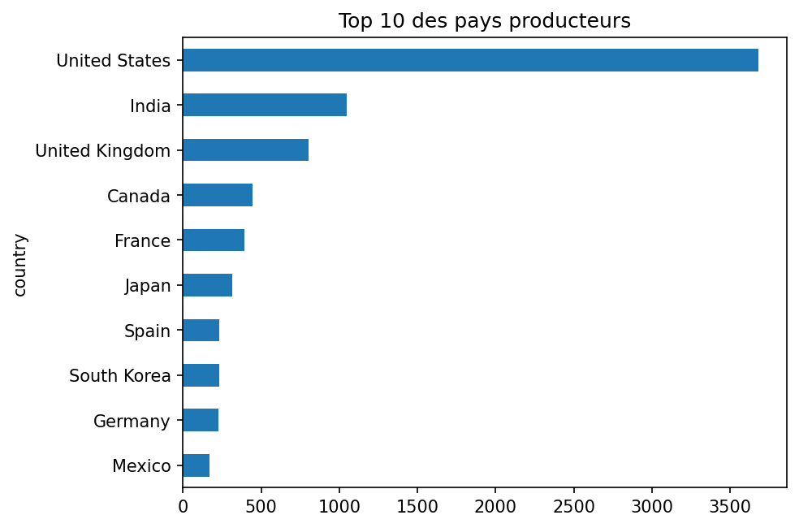
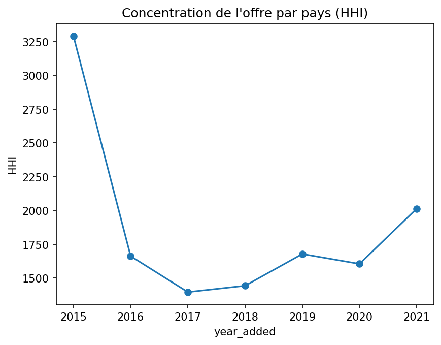

# 🎬 Analyse du catalogue Netflix

Analyse de l'évolution du catalogue Netflix et de la **concentration de l'offre par pays de production**, avec un angle d'économie numérique.

## 🎯 Objectif

Explorer le catalogue Netflix pour répondre à deux questions :
- Comment le catalogue (films et séries) a-t-il évolué dans le temps ?
- L'offre est-elle concentrée sur quelques pays, et Netflix diversifie-t-il ses contenus vers des productions locales ?

## 📂 Données

Dataset Kaggle **« Netflix Movies and TV Shows »** ([lien vers la page Kaggle]).
Il contient le type de contenu (film ou série), le titre, le pays, la date d'ajout, l'année de sortie, la classification, la durée et les genres.

## 🛠️ Outils

Python • pandas • matplotlib • Jupyter Notebook • Git/GitHub

## 🔍 Méthode

1. **Nettoyage** : traitement des valeurs manquantes, suppression des doublons, conversion des dates
2. **Exploration** : répartition films/séries, évolution annuelle, pays, genres, durée des films
3. **Analyse économique** : part des 5 premiers pays et indice de Herfindahl-Hirschman (HHI) pour mesurer la concentration de l'offre, puis évolution dans le temps

## 📈 Résultats principaux

- [Conclusion 1, par exemple : les films représentent X % du catalogue]
- [Conclusion 2, par exemple : les États-Unis dominent, suivis de l'Inde et du Royaume-Uni]
- [Conclusion 3 : ce que montre l'évolution du HHI]
- [Conclusion 4 : la part des États-Unis au fil du temps]

## 🖼️ Graphiques




## 📁 Structure du projet

```
netflix-data-analysis/
├── data/                  # Données brutes (netflix_titles.csv)
├── images/                # Graphiques exportés
├── analyse.ipynb          # Notebook d'analyse complet
├── requirements.txt       # Dépendances Python
└── README.md
```

## ▶️ Lancer le projet

```bash
git clone https://github.com/TON_PSEUDO/netflix-data-analysis.git
cd netflix-data-analysis
python3 -m venv .venv
source .venv/bin/activate
pip install -r requirements.txt
```

Puis ouvrir `analyse.ipynb` dans VS Code ou Jupyter.

## 👤 Auteur

**Soufiane**, étudiant en Master 2 Économie Numérique, Université de Montpellier
[Ton LinkedIn ou ton email]
